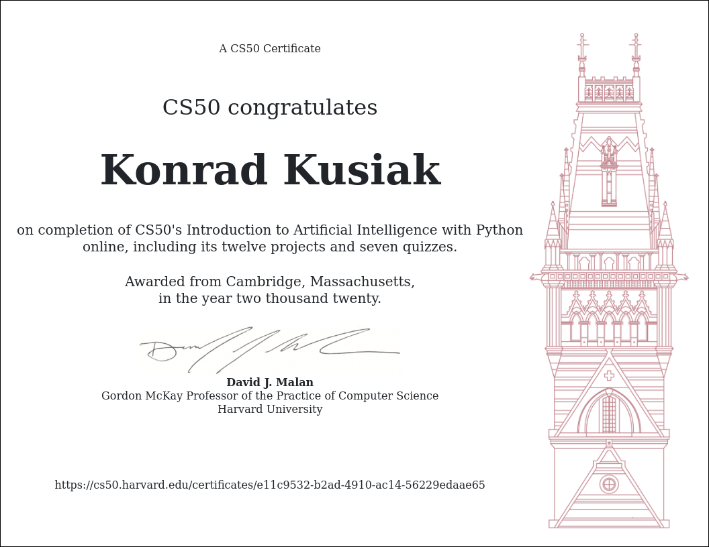

# CS50’s Introduction to Artificial Intelligence with Python

 Below, I listed all my weekly projects from an online course I pursued through the __Edx__ platform of the above title. The course focuses on an introduction to AI concepts such as _Machine Learning_ and _Neural Networks_. 
 
 Each project has a separate folder with all its code, description, and a link to a video in which I present how my program runs. 
 
 The more detialed description and further information is on the website of the [course](https://cs50.harvard.edu/ai/).

## Weekly projects outline
### Week0 "Search"
 _Degrees_, _Tic-Tac-Toe_ 
### Week1 "Knowledge" 
 _Knights_, _Minesweeper_ 
### Week2 "Uncertainty"
 _Pagerank_, _Heredity_ 
### Week3 "Optimization"
 _Crossword_ 
### Week4 "Learning"
 _Shopping_, _Nim_ 
### Week5 "Neural Networks"
 _Traffic_ 
### Week6 "Language" 
 _Parser_, _Questions_

I successfully completed the course and obtained the certificate.

    

### Tasks: "Degrees", "Tic-Tac-Toe"
    
####    1. Degrees

    
The task involve using Breadth-search first (BFS) in order to find the corresponding path from one actor to another according to theory of Six Degrees of Kevin Bacon. 

Example and full description of the task can be found on: https://cs50.harvard.edu/ai/projects/0/degrees/

2. TicTacToe

I uploaded a short video that presents the functionality of the program at: https://youtu.be/2SVmOkVgqpw
    
This task involved implementing a basic AI that would play a tic-tac-toe with you. The AI will always pick the best option which results in the fact that you can't win the game. 

The problem involves implementing a search algorithm, that AI can use in order to find the best solution or an optimal one if there is no clear distinguishing feature between them. 

The task involved implementing several functions such as player, actions, result, winner, terminal, utility and minimax. The main search algorithm runs in minimax, where I implemented it with the idea of Alpha-Beta Pruning. This is an optimazation which provides that the AI will not search through all the possible solutions but rather until it finds the best one. 

The idea of an algorithm, in short can be desribed in a following way: The X player wants to maximize the result and the O player wants to minimize it. In this way, we represent a winning-X board game with a 1 and winning-O game with -1. The tie board game would be 0. During the game the AI will recursively try all the possible moves that can be made, and after each move it will consider what its oponent would do in the next move. This logic is implemented in the minimax function. The Alpha-Beta pruning optimazation of course provides that the AI won't always go through all the possible moves. 

Full description of the task can be found at: https://cs50.harvard.edu/ai/projects/0/tictactoe/
    
WEEK 1 ~ KNOWLEDGE

Tasks: "Knigths", "Minesweeper"

    1. Knights

    Short video with functionality of the program: https://youtu.be/BeXnsyBBVoo

    This task was based on a book published by Raymond Smullyan in 1978 called "What is the name of this book". It's a book of logical puzzles and one of them is called "Knights and Knaves". 

    Considering the contrains of the puzzle which assume that Knights always tell the truth and Knaves always lie, I wrote a program that finds out who is a kinght and who is knave based on what the people said. 

    The task involved manipulating with built structures in Python such as Implication, Or and And operators. 

    The 'intelligent' part of the program was based on the idea of inferences. That the program, given a couple of initial constrains and facts, can infere some new assumptions from them.

    Full description can be found at: https://cs50.harvard.edu/ai/2020/projects/1/knights/

    2. Minesweeper

    Video with functionality: https://youtu.be/f4u2wQyHCYU

    This task was to implement a well-known game "Minesweeper" in a way that the computer will play it. 

    This is another example of idea of working with inferences. Computer, given some initial variables, will infer which fields are safe and he will choose them next. 

    Some of the ways how to infere new assumptions are following:
        - if we have a cell with number 0, we can infere that there is no bomb in any surrounding cell,
        - if the number of surrounding cells that are not safe is equal to the number on the cell it means that all the cells have a bomb.

    Based on logical assumptions like those, AI can recursively try infere new information about the board. 

    Full description can be found at: https://cs50.harvard.edu/ai/2020/projects/1/minesweeper/

WEEK 2 ~ UNCERTAINTY

Tasks: "PageRank", "Heredity"

    1. PageRank

    Video Link: https://youtu.be/oCqDr5F4kI8

    This week's tasks are based on the idea of AI which needs to make unsure decisions. The way how to work with those situations is taking into account theory of Probability.

    In the PageRank task, I wrote a program which ranks web-pages by importance. The algorithms I used were Random Surfer model, where a random user is considered who clicks on the links at random. Therefore, the more links to a certain page, the higher probability the surfer will end up there. 

    Since this algorithm is not functioning well if all the webpages are not connected (are not forming one graph but more), I used as well the Iterative algorithm. 

    Full description at: https://cs50.harvard.edu/ai/2020/projects/2/pagerank/

    2. Heredity

    Video Link: https://youtu.be/cBHMXESVGS0

    This program asses probability that certain person will have particular genetic trait.

    Given certain data about particular people such as:
     - mother's data,
     - father's data
     - boolean value of trait (if the person has it or not)

    Taking into consideration certain constrains about inheriting the bad gene, the program calculates the probability that the people in the data have the gene. 

    Full description at: https://cs50.harvard.edu/ai/2020/projects/2/heredity/

WEEK 3 ~ OPTIMIZATION

Tasks: "Crossword"

    1. Crossword

    Video Link: https://youtu.be/3JEeBEHPODI

    The task involved creating an AI that will solve a crossword puzzle, given some words dataset. 

    This problem can be described as a constrain satisfaction problem, where the nodes in the graph are represented by each empty field in the crossword. Such a node contains two information:
        - number of empty cells
        - direction 
    the AI, will take those information into consideration in order to choose the proper words for the slot. 

    AI will as well choose the words, based on the fact which they collide with each other or not. Therefore, each node, will contain as well a domain which is a set of words that fit into the slot and have corresponding word that fits with them in the colliding nodes. In order to find those words, I implemented AC3 Algorithm together with enforce_node_consistency function which takes care about previous constrains (directoin and length). The order domain_domain_values function orders the domain according to the least-constraining values heuristic. And the select_unassigned_variable function picks not yet assigned node according to the minimum remaining value heuristic and then the degree heuristic.

    Lastly, the whole AI operates in the backtracking function which is an algorithm that makes sure the AI will recursively try fitting all the nodes and will backtrack if there is some incorrect result. 

    Full description at: https://cs50.harvard.edu/ai/2020/projects/3/crossword/

WEEK 4 ~ LEARNING

Tasks: "Shopping", "Nim"
    
    1. Shopping

    Video Link: https://youtu.be/o2D3_es346s

    This AI predicts whether online shopping customers will complete a purchase. 
    Given some data (in the prgram, I was provided with data of some shopping website from about 12000 users), the program splits it into two sets, one for training and the other for checking the model. 

    With the help of scikit-learn library in Python, I created a K-Neighbours classifier model and trained it. In this model, depending on a number K, it considers K-number of closest neighbours of each data point and chooses the most common class among them. 

    Full description at: https://cs50.harvard.edu/ai/2020/projects/4/shopping/

    2. Nim

    Video Link: https://youtu.be/W9qwFVfnd5U

    In this task I created an AI that teaches itself to play Nim through reinforcement learning. 

    The idea of reinforcement learning is that with each move, the AI gets some reward or punishment. The reward of the next move is composed of the state in which the AI will be afterwards but as well of the future potential rewards that it can get. 

    In the project, I use the Q-learning algorithm in order to update the values of the rwards of each states. After 1000 trainings I found that it is already hard to win with AI although still possible. 

    Full description at: https://cs50.harvard.edu/ai/2020/projects/4/nim/

WEEK 5 ~ NEURAL NETWORKS

Tasks: "Traffic"

    1. Traffic

    Video Link: 

    In this task, I was supposed to create a convolutional neural network that would be able to identify traffic signs that appear on a photograph.

    I used OpenCV in order to create usable format from a photo (numpy ndarray) that I could later feed into my neural network. 
    
    With a help of tensorflow.keras API I created a model of convolutional neural network. 
    
    The chosen parameters of my neural network are derived from multiple tests of accuracy. 

    The structure of my neural network is as follows:
    
WEEK 6 ~ LANGUAGE

Tasks: "Parser", "Questions"

