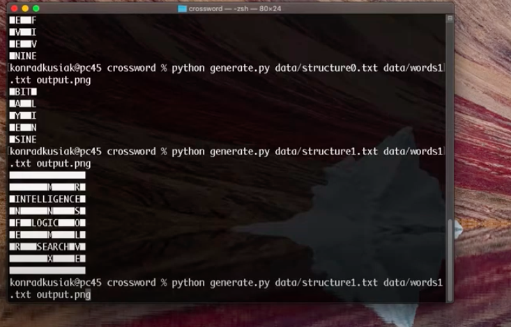

# Crossword

 

 The task involved creating an AI that will solve a crossword puzzle, given some words dataset. 

 This problem can be described as a constrain satisfaction problem, where the nodes in the graph are represented by each empty field in the crossword. Such a node contains two information:
     - number of empty cells
     - direction 
 the AI will consider that information in order to choose the proper words for the slot. 

 AI will as well choose the words, based on the fact which they collide with each other or not. Therefore, each node will contain as well a domain which is a set of words that fit into the slot and have the corresponding word that fits with them in the colliding nodes. To find those words, I implemented the AC3 Algorithm together with the enforce_node_consistency function which takes care of previous constraints (direction and length). The order domain_domain_values function orders the domain according to the least-constraining values heuristic. And the select_unassigned_variable function picks not yet assigned node according to the minimum remaining value heuristic and then the degree heuristic.

 Lastly, the whole AI operates in the backtracking function which is an algorithm that makes sure the AI will recursively try fitting all the nodes and will backtrack if there is some incorrect result. 

 Full description is [here](https://cs50.harvard.edu/ai/2020/projects/3/crossword/)