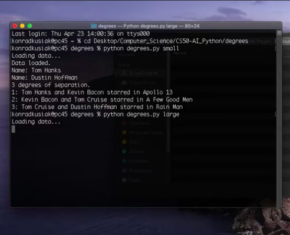

# Degrees

 
 
 The task involved using Breadth-Search First (BFS) algorithm in order to find the corresponding path from one actor to another according to theory of Six Degrees of Kevin Bacon. 

Example and full description of the task can be found on: https://cs50.harvard.edu/ai/projects/0/degrees/
