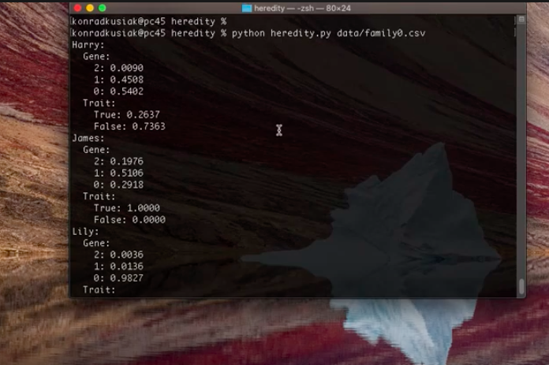

# Heredity

 

 This program asses the probability that a certain person will have a particular genetic trait.

 Given certain data about particular people such as:
     - mother's data,
     - father's data
     - boolean value of trait (if the person has it or not)

 Taking into consideration certain constraints about inheriting the bad gene, the program calculates the probability that the people in the data have the gene. 

 Full description is [here](https://cs50.harvard.edu/ai/2020/projects/2/heredity/)