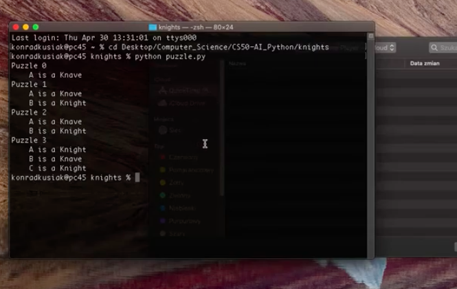

# Knights

 

 This task was based on a book published by Raymond Smullyan in 1978 called "What is the name of this book". It's a book of logical puzzles and one of them is called "Knights and Knaves". 

 Considering the constraints of the puzzle which assume that Knights always tell the truth and Knaves always lie, I wrote a program that finds out who is a knight and who is knave based on what the people said. 

 The task involved manipulating with built structures in Python such as Implication, Or, And operators. 

 The 'intelligent' part of the program was based on the idea of inferences. That the program, given a couple of initial constraints and facts, can infer some new assumptions from them.

 Full description can be found [here](https://cs50.harvard.edu/ai/2020/projects/1/knights/)