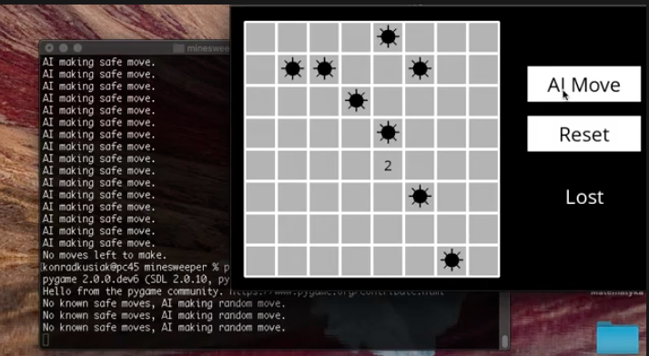

# Minesweeper

 

 
 This task was to implement a well-known game "Minesweeper" in a way that the computer will play it. 

 This is another example of the idea of working with inferences. Computer, given some initial variables, will infer which fields are safe and he will choose one of them on the next move.

 Some of the ways how to infer new assumptions are following:
    - if we have a cell with number 0, we can infer that there is no bomb in any surrounding cell,
    - if the number of surrounding cells that are not safe is equal to the number on the cell it means that all the cells have a bomb.

 Based on logical assumptions like those, AI can recursively try infer new information about the board. 

 Full description can be found [here](]https://cs50.harvard.edu/ai/2020/projects/1/minesweeper/)
