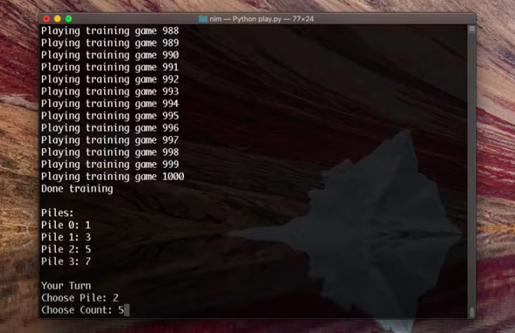

# Nim

 In this task, I created an AI that teaches itself to play Nim through reinforcement learning. 

 The idea of reinforcement learning is that with each move, the AI gets some reward or punishment. The reward of the next move is composed of the state in which the AI will be afterward but as well of the future potential rewards that it can get. 

 In the project, I use the Q-learning algorithm in order to update the values of the rewards of each state. After 1000 pieces of training I found that it is already hard to win with AI although still possible. 

 Full description is [here](https://cs50.harvard.edu/ai/2020/projects/4/nim/)