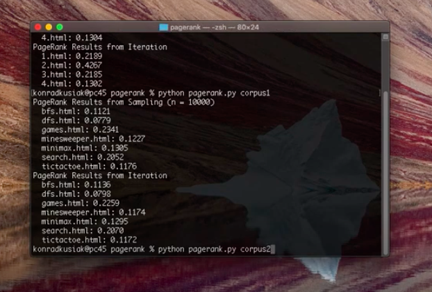

# Pagerank

 

 This week's tasks are based on the idea of AI which needs to make unsure decisions. The way how to work with those situations is by taking into account the theory of Probability.

 In the PageRank task, I wrote a program that ranks web-pages by importance. The algorithms I used were the Random Surfer Model, where a random user is considered who clicks on the links at random. Therefore, the more links to a certain page, the higher probability the surfer will end up there. 

 Since this algorithm is not functioning well if all the webpages are not connected (are not forming one graph but more)I used as well the Iterative algorithm. 

 Full description is [here](https://cs50.harvard.edu/ai/2020/projects/2/pagerank/)