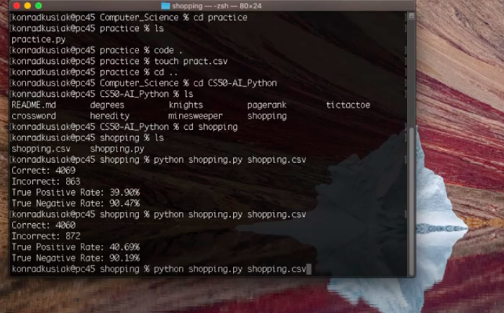

# Shopping

 

 This AI predicts whether online shopping customers will complete a purchase. 
 
 Given some data (in the program, I was provided with data of some shopping websites from about 12000 users), the program splits it into two sets, one for training and the other for checking the model. 

 With the help of the Scikit-Learn library in Python, I created a K-Neighbours classifier model and trained it. In this model, depending on a number K, it considers the K-number of closest neighbors of each data point and chooses the most common class among them. 

 Full description is [here](https://cs50.harvard.edu/ai/2020/projects/4/shopping/)