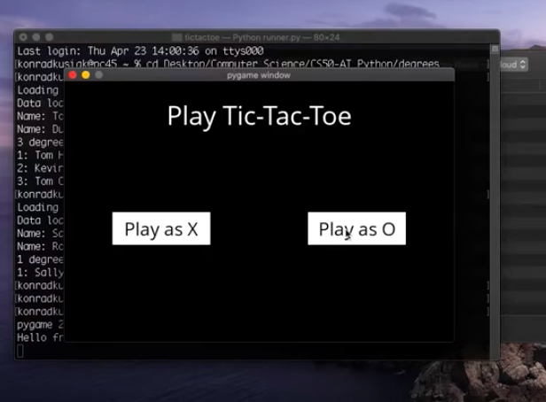

# Tic Tac Toe

 

 This task involved implementing a basic AI that would play a tic-tac-toe with you. The AI will always pick the best option which results in the fact that you can't win the game. 

 The problem involves implementing a search algorithm, that AI can use in order to find the best solution or an optimal one if there is no clear distinguishing feature between them. 

 The task involved implementing several functions such as player, actions, result, winner, terminal, utility, and minimax. The main search algorithm runs in minimax, where I implemented it with the idea of Alpha-Beta Pruning. This is an optimization that provides that the AI will not search through all the possible solutions but rather until it finds the best one. 

 The idea of an algorithm, in short, can be described in the following way: The X player wants to maximize the result and the O player wants to minimize it. In this way, we represent a winning-X board game with a 1 and winning-O game with -1. The tie board game would be 0. During the game, the AI will recursively try all the possible moves that can be made, and after each move, it will consider what its opponent would do in the next move. This logic is implemented in the minimax function. The Alpha-Beta pruning optimization of course provides that the AI won't always go through all the possible moves. 

 Full description of the task can be found [here](https://cs50.harvard.edu/ai/projects/0/tictactoe/).