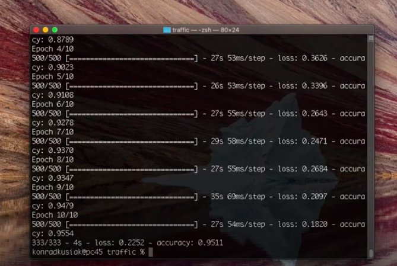

# Traffic

 In this task, I was supposed to create a convolutional neural network that would be able to identify traffic signs that appear on a photograph.

 I used OpenCV in order to create a usable format from a photo (NumPy ndarray) that I could later feed into my neural network. 
    
 With a help of TensorFlow.Keras API I created a model of a convolutional neural network. 
    
 The chosen parameters of my neural network are derived from multiple tests of accuracy. 

 The full description is [here](https://cs50.harvard.edu/ai/2020/projects/5/traffic/)
